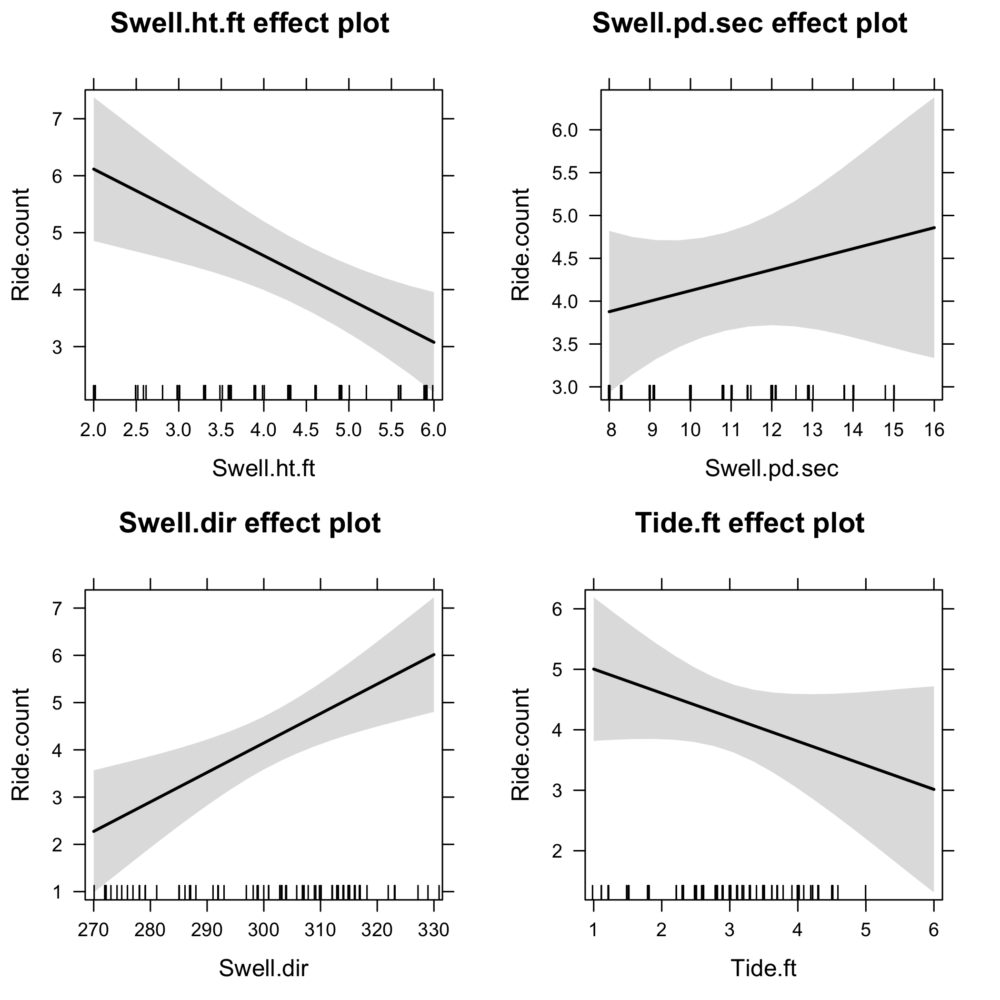

```{r setup, include = FALSE, cache = FALSE}
knitr::opts_chunk$set(echo = FALSE, message = FALSE, 
                      fig.path = 'figs/', cache.path = 'cache/graphics-', 
                      fig.align = 'center', fig.width = 5, fig.height = 5, fig.show = 'hold', cache = TRUE, par = TRUE)

```

## *surflog*: a personalized tool to predict the best conditions for your favorite surf spot 

Athletes have embraced new technologies to improve and enjoy their sporting activities.  For example, Strava (<https://www.strava.com/>) is a mobile app and website designed for runners and cyclers to track their routes. Surfers are no different. While there are many apps geared towards understanding surf conditions (e.g., <http://www.surfline.com/home/index.cfm>, <http://magicseaweed.com/>), and more recently, sensors to track individual rides (<http://www.traceup.com/>), there is a clear void in the middle ground.  

I view this middle ground as being a simple, personalized application that learns from each individuals lifetime surfing experience, and predicts the quality of a surf session based on simple inputs. In other words - I seek to help answer age-old questions for surfers, like - should I go surfing today? Where should I go surfing today? But the answers to these questions are not generic (e.g., from surfing websites), but rather, tailored to the individual. 

### User inputs
After each session, the surfer inputs a few key metrics about their surf. 
For example:

  - Date, Time, Site, Site_aspect (i.e., compass heading), Rating (how good was the session; scale of 1-10), Ride_count (number of rides), Surface_condition (i.e., glassy; scale of 1-10), Board (which board did I use)
  
### *surflog* outputs
The surfer inputs are used to determine the following outputs for each session, 

  - Swell_period, Swell_height, Swell_direction, Tide_height, Tide_action (rising or falling?), Wind_speed

using the following data sources:

  - Swell conditions scraped from NOAA <http://www.ndbc.noaa.gov/>
  - Tide height scraped from <http://tbone.biol.sc.edu/tide/>

### Visualization and prediction

The data are then used for two purposes:

  1. Visualize surfing trends (by time, site, surfboard, etc)
  2. Predict the *personalized* quality of surf, given a set of conditions (e.g., swell and tide)

As an example, I have plotted the number of surf sessions in central California over the past ~3 years:


But the real benefit of the app will be to inform the user whether a particular site, given the current conditions, will be worth surfing. The statistical model will take the current NOAA and tide conditions, and integrate them with the historical user data to predict a metric of quality (e.g., number of predicted rides, rating). 

For example, I used 86 records of surf sessions at one site near Monterey, California to make predictions using a simple linear model with swell period, swell height, swell direction, and tide. The predicted number of rides for each variable is presented below:



## Conclusions

In brief, the model suggests I have the best session (in terms of ride count) when the swell height is small (< 4 ft) and the swell direction is from the northwest (> 300).  To a lesser extent, I surf more waves at lower tide and when the swell is larger, but these effects are marginal. 

This analysis is based on my surf log, together with hand-entered data for the swell and tide conditions. However, the data scraping can be automated. Moreover, the statistical model can likely be improved. During the Data Incubator fellowship, I foresee the following steps for completing the app:

  1. Automate the web scraping of NOAA and tide conditions
  2. Determine the best statistical model (e.g., regression, CART, etc)
  3. Develop the app to be user friendly (i.e., not a spreadsheet and R)
  


