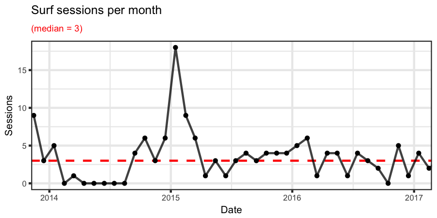
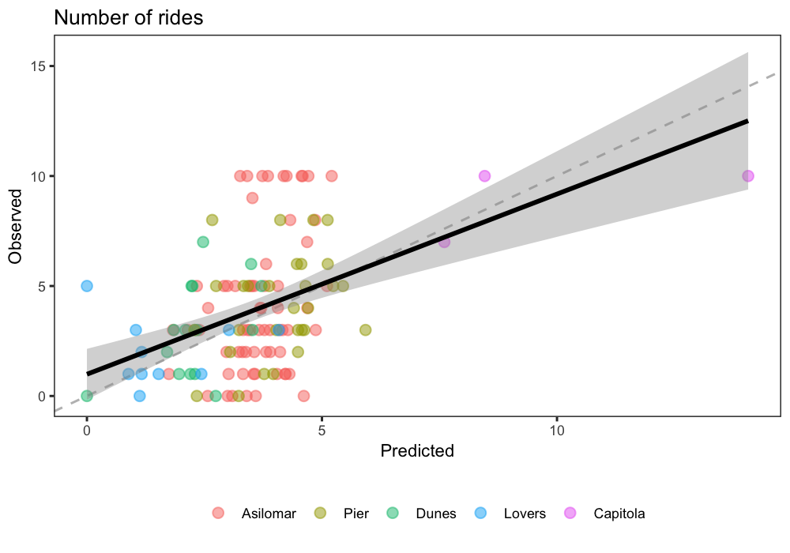

```{r setup, include = FALSE, cache = FALSE}
knitr::opts_chunk$set(echo = FALSE, message = FALSE, 
                      fig.path = 'figs/', cache.path = 'cache/graphics-', 
                      fig.align = 'center', fig.width = 5, fig.height = 5, fig.show = 'hold', cache = TRUE, par = TRUE)

```

## *surflog*: a tool to predict the best surf for you

Athletes have embraced new technologies to improve and enjoy their sporting activities.  For example, Strava (<https://www.strava.com/>) is a mobile app and website designed for runners and cyclers to track their routes. Surfers are no different. While there are many apps geared towards understanding surf conditions (e.g., <http://www.surfline.com/>, <http://magicseaweed.com/>), and more recently, sensors to track individual rides (<http://www.traceup.com/>), there is a clear void in the middle ground.  

I view this middle ground as a simple, personalized application that learns from each individuals lifetime surfing experience, and predicts the quality of a surf session based on simple inputs. In other words - I seek to help answer age-old questions for surfers, like - should I go surfing today? Where should I go surfing today? But the answers to these questions are not generic (e.g., from surfing websites), but rather, tailored to the individual. 

### User inputs

After each session, the surfer inputs a few key metrics about their surf. 
These would include, for example:

  - Date
  - Time
  - Site
  - Rating (how good was the session; scale of 1-10)
  - Ride count (number of rides) 
  - Board (which board did I use)

### Ocean conditions

The user inputs are used to determine the conditions for each session, including:

  - Swell height
  - Swell period
  - Swell direction
  - Tide height
  - Wind speed

using the following data sources:

  - Hourly records of swell conditions from NOAA buoys
    - <http://www.ndbc.noaa.gov/>
  - Hourly records of tide height using the R package *rtide* 
    - <https://cran.r-project.org/web/packages/rtide/index.html>

### *surflog* outputs

The user inputs and ocean conditions are used for two purposes:

  1. Visualize surfing trends 
  2. Predict the *personalized* quality of surf, given a set of ocean conditions

I used a dataset of surf sessions over three years in Monterey, California for demonstration. This surf log was then integrated with hourly buoy data from Monterey Bay from 2013-present, as well as hourly tidal heights for Monterey bay over the same period. 

I used the following packages in **R**:

  - Data wrangling: dplyr, readr, tidyr, lubridate
  - Plotting: ggplot2, cowplot
  - Mapping: ggmap
  - Other: rtide, effects, knitr

#### 1. Visualizing surfing trends

Below, I plot the monthly number of surf sessions:



<br>

And here I plot the spatial distribution of the surf sessions, summarized in the following ways:

  - the total number of sessions at each site
  - the median number of rides per session at each site
  - the median rating per session at each site
  


<br>

#### 2. Predicting the quality of surf sessions

The real benefit of the app will be to inform the user whether a particular site, given the current conditions, will be worth surfing.  The statistical model will take the current NOAA, tide, and weather conditions, and integrate them with the historical user data to predict a metric of quality. As a simple starting point, I fit the following generalized linear model, using a poisson distribution because I was modeling a count outcome (the number of rides per session *i*):

$$Rides_{i} = Poisson(\mu_{i})$$
$$E(Rides_{i}) = var(Rides_{i}) = \mu_{i}$$

$$log(\mu_{i}) = \alpha + \beta_{h}Height_{i} + \beta_{p}Period_{i} + \beta_{d}Direction_{i} + \beta_{t}Tide_{i}$$ 

where *Height* is swell height (WVHT; m), *Period* is the dominant swell period (DPD; s), *Direction* is the mean wave direction (MWD; degrees), and *Tide* is the tidal height (TideHeight; m). 

I fit the model to the central California surf log for each site separately. I can use the model to predict the number of rides as a function of each variable (while holding all others at their median value), and thus visualize the partial effects for one site below: 


<br>

These partial effects plots suggest the central California Surfer has the best session (in terms of ride count) when the swell height is small (< 4 ft) and the swell direction is from the northwest (> 300).  To a lesser extent, central California surfer surfs more waves at lower tide and when the swell is larger, but these effects are marginal. 

I used this modeling approach to predict the number of rides at hourly intervals for each of five sites over a three year period. Here I focus on the ability of the model to hindcast surf quality in order to validate and fine-tune the modeling approach. Ultimately, however, the goal will be to forecast future surf quality given the current and predicted ocean conditions. 

For simplicity, I will focus on five randomly selected days for which there was a surf session, and compare the predicted number of rides (at all of the sites) with the observed number of rides at a single site. 


<br>

On some dates, the model fit the data reasonably well- for example, the predictions for 2014, 2016, and 2017 were very similar to the actual number of rides. The best site, for a given time, was chosen on several occasions, but the timing and location could have been better to catch more waves (e.g., 2014, 2016). 

In summary, I plot the observations against predictions below:



<br> 

The model appears to fit the extremes better than intermediate values, but a few more sessions are needed (especially at Capitola!) to improve confidence in these estimates. 

## Next steps

This analysis is based on an example surf log, integrated with hourly swell and tide conditions over a three year period - and demonstrates reasonable proof of concept. However, there is room for improvement in many respects. For example: 

  1. Automate the web scraping of NOAA and tide conditions for any given site
  2. Automate the web scraping of weather conditions (and incorporate into model)
  3. Improve the modeling approach
  4. Train the model with a larger dataset
    - Include surfers of varying experience, gender, age, fitness level
    - Include different regions of the world
  5. Test the sensitivity of the predictions to data availability
  6. Forecasts in addition to hindcasts
  7. Develop a user-friendly tool
    - Simple input on mobile device
        - use existing technologies to make this painless
        - e.g., location services, reminders for input, speech recognition
    - Simple output
        - create a ranking system of the surfer's beaches given a set of conditions
        - identify when there is high (green light) or low (yellow light) confidence for a given prediction 
  
## Copyright
Copyright 2017 Robin Elahi

<https://github.com/elahi/surflog/blob/master/LICENSE>


