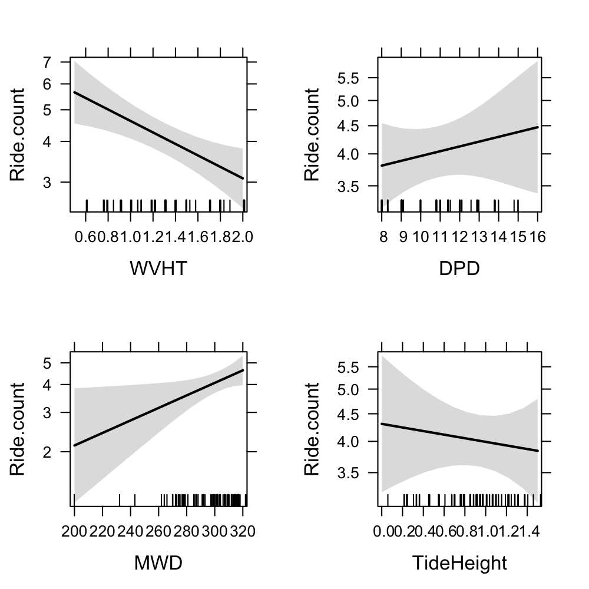

```{r setup, include = FALSE, cache = FALSE}
knitr::opts_chunk$set(echo = FALSE, message = FALSE, 
                      fig.path = 'figs/', cache.path = 'cache/graphics-', 
                      fig.align = 'center', fig.width = 5, fig.height = 5, fig.show = 'hold', cache = TRUE, par = TRUE)

```


## *surflog*: a tool to predict the best surf for you

- User inputs
- Ocean conditions
- *surflog* outputs
    1. Visualize your sessions
    2. Predict where and when to surf

\newpage

## Visualize your sessions


\newpage

## Visualize your sessions 


\newpage

## Predict where and when to surf

Generalized linear model with four predictors

  - Swell height (WVHT), period (DPD) and direction (MWD)
  - Tidal height (TideHeight)
  
$$Rides_{i} = Poisson(\mu_{i})$$
$$E(Rides_{i}) = var(Rides_{i}) = \mu_{i}$$
$$log(\mu_{i}) = \alpha + \beta_{h}Height_{i} + \beta_{p}Period_{i} + \beta_{d}Direction_{i} + \beta_{t}Tide_{i}$$ 

{width=90%}

\newpage

## Predict where and when to surf


\newpage

## Predict where and when to surf


\newpage

## Github page

<https://github.com/elahi/surflog/>


